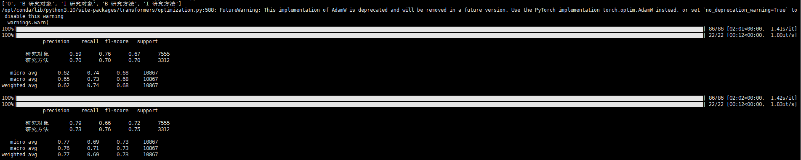

## 介绍（正在更新中）

这是一个统计学中文核心期刊知识图谱构建及应用的项目。可以帮助各位快速构建学术领域的知识图谱，并借助RAG和微调大语言模型，快速构建基于NEO4J知识图谱的问答系统。其主要步骤包含：

- [命名实体识别-NER](#命名实体识别)
- [NEO4j知识图谱构建](#NEO4j知识图谱构建)
- [微调大语言模型-LORA](#微调大语言模型)

## 命名实体识别

这是一个基于BERT-BILSTM-CRF模型的命名实体识别项目，使用torch进行建模，目的是为了帮助初学者快速构建NER模型，因此从dataloader到train基本都进行了注释。

数据由我们亲爱的Z网提供，使用selenium爬取了基本信息，包含摘要、关键词、题目、作者、通讯作者等。

命名实体识别的工作主要是从期刊摘要中抽取【研究对象】和【研究方法】。

<details><summary>数据标注</summary>
数据采用BIO标注，一共只有两类实体：【研究对象】和【研究方法】。PS1：别骂实体少，俺也不是想偷懒。

首先用GPT4进行初步的抽取，然后再人工核查，数据集的质量个人感觉还是不错的。

提示词和大模型没有使用langchain或llama-index，自己编了一套提示词，您可以在[statistics-ner/data/gpt_data_tagging.py](statistics-ner/data/gpt_data_tagging.py)中查看。

PS2：由于本项目是于2023年做的，直到现在才上传github，目前（2024年7月）GPT4的API接口已经无法使用，各位可以维持提示词不变，采用其他的大语言模型进行数据标注，也可以使用一些通用的实体识别模型（如RaNER等）进行初步的数据标注。
</details>

<details><summary>快速运行</summary>
如果你想直接进行运行并查看效果，而非在自己的数据上进行预训练。只需要：

第一步，将本项目拖至您的本地，同时安装python的依赖库，如何创建python环境，这里就不进行赘述了。

```bash
git clone --depth 1 https://github.com/markoov/statistics-neo-llm.git
cd statistics-neo-llm
pip install -r requirements.txt -i https://pypi.tuna.tsinghua.edu.cn/simple
```

第二步，将bert模型下载至您的本地模型目录，可以通过modelscope或huggingface下载，也可以直接将您本地的模型文件复制进来。这里给出一个从modelscope中下载roberta-wwm-ext模型的代码。下载完成之后，你需要在[config](statistics-ner/config.py)中修改`self.bert_dir`参数，您下载了什么模型，直接替换其名字便可。
PS：根据经验，相同size的bert模型，训练的最终结果不会有特别显著的差距。

```bash
cd statistics-ner/model-hub
git lfs install
git clone ----depth 1 https://www.modelscope.cn/dienstag/chinese-bert-wwm-ext.git 
```

第三步，回到statistics-ner目录下，开始训练。PS：注意当前目录即可，因为config内没有用os查询当前目录，在下也懒得改了。

```bash
cd ..
python main.py
```

训练步骤使用tqdm进行了进度条管理，每一个epoch进行一次验证，每save_step步保存一次模型，训练日志将保存loss和P\R\ACC等指标。日志文件将存入statistics-ner/checkpoint/statistics目录。

在下使用了一块3090显卡进行训练，在本项目的数据集和参数配置下，大约需要占用18GB的显存，一个epoch耗时在2分钟左右。这里给出一个训练了2个epoch的结果，如果希望结果能更加好看，估计需要训练30轮左右。



</details>

<details><summary>使用你自己的数据进行训练</summary>

想要使用你自己的数据，训练你自己的模型，你需要按照[data](statistics-ner/data/val_data.json)的格式，构建BIO数据集，主要特征只需要包含id，text和label三列。数据标注和制作训练集、验证集的过程为简单的python数据分析的内容，这里不做赘述。

</details>

## NEO4j知识图谱构建

在使用该项目构建neo4j知识图谱前，我们建议您拥有基本的neo4j使用经验。由于这只是一个基础的入门项目，作者将根据本项目的反响来判断是否对这一部分内容进行详细的介绍和叙述。为了方便部分已经有基础的同学快速构建知识图谱，我们将所需的所有数据进行了开源。包括[原始数据](statistics-neo/ori-dataset/origin_data.csv)和[实体及关系数据](statistics-neo/result-data-json)
您可以使用py2neo导入该数据，这里将给出一份示例。

```bash
import json
from py2neo import Graph
graph = Graph('http://localhost:7474', auth = ('neo4j', 'password'), name="statistics")
json_file_path = f'statistics-neo/result-data-json/thsis_subjects.json'
with open(json_file_path, 'r', encoding='utf-8') as file:
    data = json.load(file)
for i in data:
    query_body = '''MATCH (p:`论文`),(q:`研究方法`) where p.id="%s" and q.name="%s" create (p)-[:研究方法{研究时期:p.发表年份}]->(q)'''%(i['id'],i['研究方法'])
    graph.run(query_body)
```

当然，我们更建议您使用`neo4j-admin database import full`的方法导入数据，这将为您节省99%的时间！
只是可能需要您对我们所提供的json数据进行一些必要的处理。

## 微调大语言模型

**感谢**：[hiyouga/LLaMA-Factory](https://github.com/hiyouga/LLaMA-Factory)项目提供的便捷训练框架。PS：DeepSpeed训练的部分做的太好了！十分方便！

<details><summary>数据准备</summary>

针对大语言模型的微调，我们使用GPT4、GPT3.5、Qwen、GLM3等模型构建了统计学问答对数据集，各位可以在[data](statistics-llm/statistic_train.json)中自行查看，我们针对数据进行了泛化（每个问答对维持output不变，对input泛化5次）。

PS：在实际场景中，建议谨慎进行问答对泛化，如果你有具体的应用场景，可以酌情使用。

</details>

<details><summary>训练步骤</summary>

第一步，拉下LLaMA-Factory项目。

```bash
cd statistics-llm
git clone https://github.com/hiyouga/LLaMA-Factory.git
```

第二步，将[训练文件](statistics-llm/statistic_train.json)放入其中的data目录下，并在dataset_info.json中配置相关参数，也可以直接将下面这个示例复制粘贴进去。

```bash
  "statistics":{
    "file_name": "statistic_train.json",
    "columns":{
      "prompt":"instruction",
      "query":"input",
      "response":"output"
    }
  }
```

第三步，下载大语言模型至你的本地目录，你可以自己新建一个目录，没必要将大模型文件放在该项目的目录下，当然LLaMA-Factory项目也是如此。

第四步，按照您的需求配置sft.sh文件，由于项目更新，过去的lora配置找不着了，这里给出一个我之前用弱智吧数据训练的示例[sft](statistics-llm/sft.sh)。为方便各位使用，在下针对部分参数进行了注释。

嫌麻烦的同学只需要修改其中与路径相关的参数，如`model_name_or_path`、`dataset`、`dataset_dir`、`output_dir`和关键配置参数，如`template`即可。详细内容也可转至[hiyouga/LLaMA-Factory](https://github.com/hiyouga/LLaMA-Factory)项目进行学习。

第四步，开始训练即可。PS：请注意您的GPU配置，正常而言，6/7B规格模型的lora微调可能需要16GB显存的显卡。

```bash
sh sft.sh
```

</details>

<details><summary>微调模型部署</summary>

我们推荐使用peft库导入lora模型的参数。
这里给出一个简单的示例，我们推荐您根据各大开源模型给出的api框架（uvicorn）配置您的大模型服务。

```bash
from peft import PeftModel
from transformers import AutoTokenizer, AutoModel
tokenizer = AutoTokenizer.from_pretrained(ChatGLM3_TOKENIZER_PATH, trust_remote_code=True)
model = AutoModel.from_pretrained(ChatGLM3_PATH, trust_remote_code=True, device_map="auto")
model = PeftModel.from_pretrained(model, "你训练好的lora模型的路径")
model = model.eval()
```

</details>